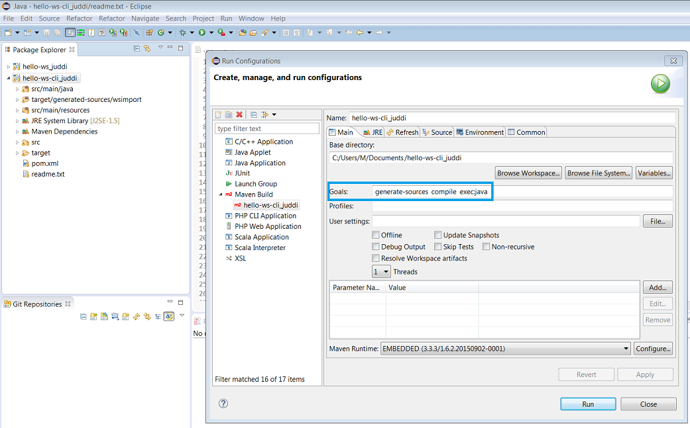
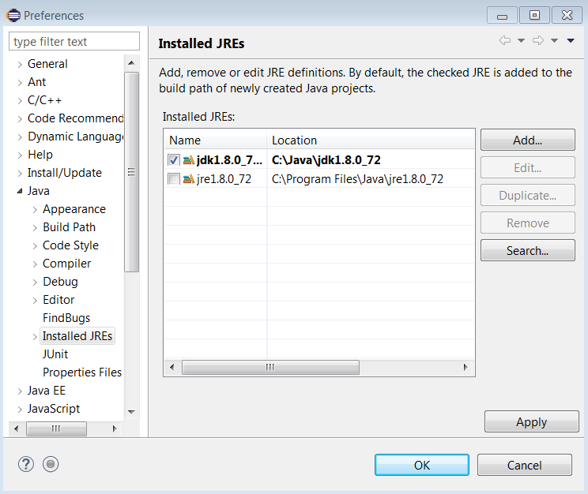
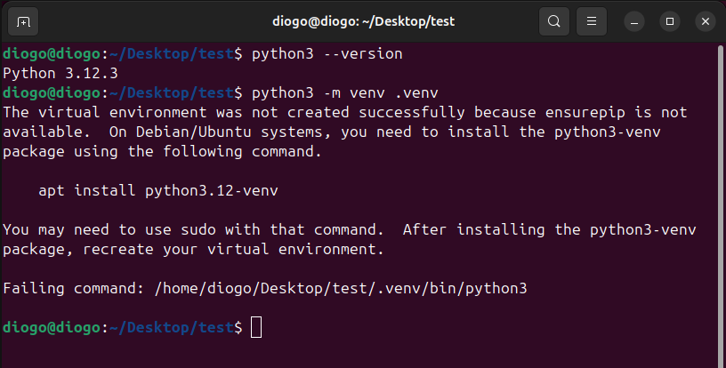

# Perguntas frequentes sobre as ferramentas


### Índice:

- [Java](#java)
- [Maven](#maven)
- [Python](#python)
- [gRPC](#grpc)

---


## <a name="java"></a> Perguntas sobre Java

### [IMPORTANTE] Existe alguma restrição sobre a directoria de instalação do software?

Sim, infelizmente devido a diversos bugs em ferramentas, o software não funciona corretamente em pastas cujo caminho tenha espaços e/ou caracteres acentuados (sobretudo em Windows). Exemplos de pastas problemáticas:

`C:\program files`
`C:\users\André`
`C:\users\Alice Silva`

Dado este problema a sugestão é instalar o software numa pasta sem acentos nem espaços, como `C:\java\`.


### Devem-se instalar exatamente as versões pedidas ou podem ser outras?

Sim, devem procurar instalar as versões pedidas de forma a terem um ambiente igual (ou o mais parecido possível) com o ambiente de referência (dos laboratórios).

Se não for possível encontrar a versão exata, pode-se instalar a versão mais próxima disponível.

### Como confirmar se estou a usar as versões certas das ferramentas?

Abrir uma consola e executar os seguintes comandos:

```
$ java -version`
$ javac -version
$ mvn -version
```

### Pergunta: Na RNL (laboratórios da Alameda), que versões do Java estão disponíveis e como as posso usar?

Ver resposta na [página da RNL](https://rnl.tecnico.ulisboa.pt/laboratorios/software).

### Como confirmar se o PATH está correcto?

- Abrir uma consola Linux e executar `$ echo $PATH`
- Abrir uma consola Windows e executar `$ echo %PATH%`


### Como resolver o seguinte problema na compilação? `Exception in thread "main" java.lang.Error: Unresolved compilation problems`

As classes foram corrompidas por diferentes compiladores em simultâneo (por ex. Eclipse e Maven).
Para corrigir ir a Eclipse -> Menu 'Project', 'Clean', 'clean all projects". Depois, correr mvn clean.


---

## <a name="maven"></a> Perguntas sobre Maven

### O meu nome de utilizador tem acentos ou espaços e preciso de mudar a localização do repositório local Maven. Como se faz?

O repositório local do Maven é a pasta onde são guardadas todas as dependências obtidas pelo Maven.

Por omissão, a localização do repositório local é:
    - `~/.m2` (Unix/Mac)
    - `C:\Users\Username\.m2` (Windows)

Para alterar a configuração, editar o ficheiro conf\setting.xml que está na pasta de instalação do Maven (tipicamente apontada pela variável de ambiente `M2_HOME`).

[Mais informação](http://www.mkyong.com/maven/where-is-maven-local-repository/)

Não esquecer também de atualizar a configuração do repositório Maven no seu IDE. Por exemplo, no Eclipse, aceder a Window - Preferences - Maven - User Settings e indicar a nova configuração.

### Como posso consultar o effective POM de um projeto Maven?

O effective POM é o resultado da combinação do POM do projeto com os valores das propriedades por omissão. É útil para perceber todas as definições que são assumidas pela ferramenta, como valores de propriedades, por exemplo.

Pode-se consulta através do seguinte comando:

`$ mvn help:effective-pom`


### Existe forma de consultar a árvore de dependências de um projeto Maven?

Sim, através do seguinte comando:

`$ mvn dependency:tree`


### Como remover o aviso de *character encoding* do Maven?

Acrescentar a seguinte configuração ao pom.xml:

```xml
...
<properties>
    <project.build.sourceEncoding>UTF-8</project.build.sourceEncoding>
    <project.reporting.outputEncoding>UTF-8</project.reporting.outputEncoding>
    ...
```

### Como remover o aviso `Warning: killAfter is now deprecated" do Maven`?

Para remover este aviso (inofensivo) pode-se acrescentar a seguinte configuração ao `pom.xml`:

```xml
    <plugin>
        <groupId>org.codehaus.mojo</groupId>
        <artifactId>exec-maven-plugin</artifactId>
        ...
            <configuration>
            <killAfter>-1</killAfter>
            ...
            </configuration>
        </plugin>
```

### Como definir a versão do Java considerada pelo Maven?

[Ver a resposta aqui.](https://maven.apache.org/plugins/maven-compiler-plugin/examples/set-compiler-source-and-target.html)


### Qual a diferença entre `exec:java` e `appassembler` ?

`mvn exec:java` corre dentro do maven e tem os argumentos definidos no `pom.xml` com bons valores por omissão (opção preferida para desenvolvimento).

`mvn package appassembler:assemble` corre de forma autónoma do Maven e necessita que sejam indicados os argumentos (opção preferida para demonstração)

`target/bin/appassembler/... .bat arg0 arg1 ...`

Via Eclipse também se pode correr, depois de compilado, definindo-se os argumentos nas "Run Configurations".


### Como se faz a partilha de código através de módulos Maven ?

Para o fazer, criar um projeto à parte (ex. my-library).
No `pom.xml`, definir as coordenadas *groupId* (ex. `example`), *artifactId* (ex. `my-library`) e *version* (ex. `1.0-SNAPSHOT`).

Para disponibilizar o módulo no repositório Maven local (`~/.m2`), fazer: `mvn install`.

Para usar o módulo noutro projeto, basta acrescentar a dependência, indicando as coordenadas *groupId*, *artifactId* e *version* tal como se faz em relação a módulos que estão no repositório Maven central.

### É possível ter POMs hierárquicos? Como se usam?

O Maven tem dois conceitos hierárquicos: *modules* e *parent*.

```xml
<project ...>
    <!-- the parent relation -->
    <parent>
        <groupId>example</groupId>
        <artifactId>parent</artifactId>
        <version>1.0.0-SNAPSHOT</version>
    </parent>
    <artifactId>module1</artifactId>
    <!-- the modules -->
    <modules>
        <module>submodule1</module>
        <module>submodule2</module>
    </modules>
</project>
```

A relação *parent* indica que configurações de propriedades, repositórios e *plug-ins* devem ser herdadas do projeto pai.

Um *module* indica que o subprojeto deve ser incluído no processamento do ciclo de vida do projeto de topo.


---

## Dúvidas sobre Eclipse

### Pergunta: Consigo compilar e executar os exercícios de código com o Maven no terminal, mas como o faço dentro do Eclipse?

O Eclipse, depois de instalado seguindo o guia, consegue invocar ações de Maven.

Para um projeto Maven no Eclipse, é necessário criar configurações de Maven Build, como é descrito em seguida:

*Package Explorer: Right-click no nome do projeto -> Run As -> Run Configurations... -> Maven Build -> New launch configuration*



Especificando em *Base directory:* o caminho para o diretório do projeto e em *Goals:* a sequência de ações Maven a desempenhar, pode clicar em *Apply* e a partir daí poderá executar com esta parametrização através do botão *Run*.

Neste exemplo específico, ao clicar em *Run* serão executados para o projeto `hello-ws-cli_juddi` os comandos:

```
mvn generate-sources
mvn compile
mvn exec:java
```

###  Já segui todas as instruções no guia de software mas mesmo assim o Eclipse não consegue compilar código Java, o que poderá ser o problema?

É possível que, apesar do JDK estar instalado, o Eclipse esteja a apontar para um módulo JRE (Java Runtime Environment), que apenas permite executar programas Java mas não compilar.
Para resolver esta questão, por exemplo em Windows, é necessário seguir os seguintes passos:

- Ir a *Window -> Preferences -> Java -> Installed JREs -> Add...*
- Indicando o diretório do JDK instalado, deve obter o seguinte resultado (ajustando a versão):
    


Carregue em *Apply, OK*. A partir de agora, o Eclipse está configurado para invocar as ferramentas de compilação de Java, tais como o *javac*.


### Já configurei o Eclipse para usar o JDK mais recente, mas mesmo assim quando importo um projeto Maven, o Eclipse assume que é para usar J2SE5 ou outra qualquer versão estranha, como corrigir isto?

Para assegurar que o projeto Maven funciona como esperado, recomenda-se dar uma indicação explícita da versão de JDK a usar para o projeto.

Para resolver esta questão, é necessário especificar a versão no pom.xml do projeto, inserindo as tags 
`maven.compiler.source` e `maven.compiler.target` aninhadas na tag `properties`.

Exemplo concreto, aplicado ao pom.xml do projeto hello-ws-cli_juddi:

```xml
...
</dependencies>

<properties>
<project.build.sourceEncoding>UTF-8</project.build.sourceEncoding> <mainclass>example.cli.HelloClient</mainclass>
<maven.compiler.source>1.8</maven.compiler.source> <maven.compiler.target>1.8</maven.compiler.target>
...
</properties>

<build>
...
```


### Quando tento executar o Eclipse este pára com erro 13. Como resolver?

Não vale a pena reinstalar o Eclipse. 
Basta editar a PATH e remover `C:\ProgramData\Oracle\Java\javapath` caso exista, e garantir que o caminho certo é o primeiro na lista de caminhos da PATH. Se existirem outros caminhos devido a atualizações, estes devem ser removidos. 

## <a name="python"></a> Perguntas sobre Python

### Ocorreu um erro na criação do Ambiente Virtual, o que devo fazer? 

Geralmente o erro vem acompanhado de uma mensagem de erro descritiva e possivelmente do comando/ação necessária para resolvê-lo.
Caso o erro se assemelhe ao apresentado em seguida:


E o comando sugerido não o resolva, deve experimentar o seguinte comando:
`sudo apt install python3-venv`


## <a name="grpc"></a> Perguntas sobre gRPC

### Não consigo correr o `protoc`no meu portátil Mac. Como resolver?

O compilador do gRPC (`protoc`) tem uma ["open issue" com os processadores M1 da Apple](https://github.com/grpc/grpc-java/issues/7690). Quando se tenta executar o `protoc` (por exemplo, fazendo `mvn install` num projeto contendo o contrato de um gRPC), ocorre um erro.

Para contornar este problema, devem procurar estas duas *tags* `<protocArtifact>` no  POM:  

```xml
<protocArtifact>com.google.protobuf:protoc:${version.protoc}:exe:${os.detected.classifier}</protocArtifact>
<pluginId>grpc-java</pluginId>
<pluginArtifact>io.grpc:protoc-gen-grpc-java:${version.grpc}:exe:${os.detected.classifier}</pluginArtifact>
```

E substituí-las por estas:
  
```xml
<protocArtifact>com.google.protobuf:protoc:${version.protoc}:exe:osx-x86_64</protocArtifact>
<pluginId>grpc-java</pluginId>
<pluginArtifact>io.grpc:protoc-gen-grpc-java:${version.grpc}:exe:osx-x86_64</pluginArtifact>
```