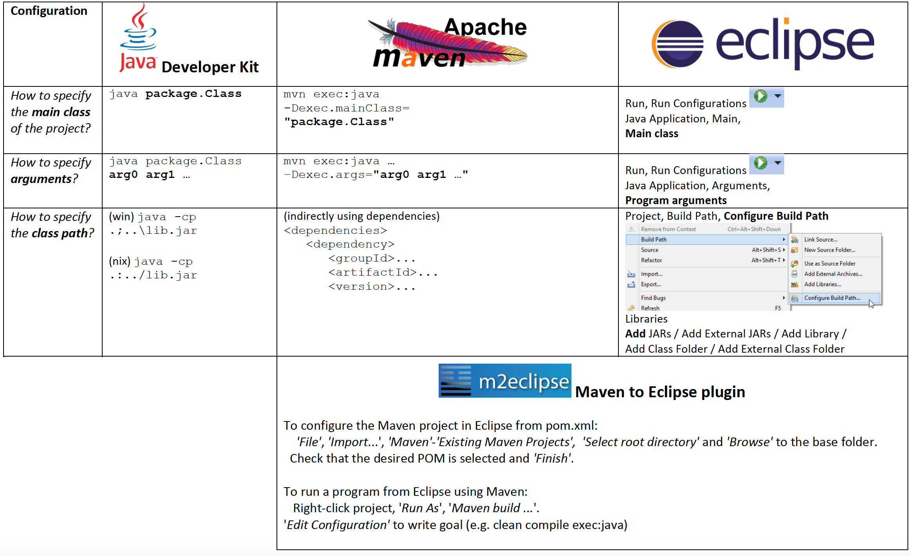

# 1. Apresentação e ferramentas (Java, Maven, IDE)

## Objetivos desta aula:

- Apresentação da/o docente e formação de grupos de projeto
- Familiarizar-se com as ferramentas de desenvolvimento que usaremos na cadeira    


***

## Apoio ao trabalho laboratorial durante o período

O professor do laboratório vai acompanhar o vosso percurso ao longo de todo o semestre. É importante ficar a conhecê-lo desde já. :-)

O apoio a dúvidas fora das aulas é feito através do [Piazza de SD](https://piazza.com/tecnico.ulisboa.pt/spring2026/sd2026), onde é possível colocar perguntas e receber respostas, quer de colegas, quer dos professores. Se não conseguir aceder ao Piazza, peça ajuda ao docente laboratorial.

 
## Inscrição de grupo

O trabalho de laboratório e no projeto é realizado em grupo, com 3 elementos. Os grupos terão de ser formados entre estudantes inscritos no mesmo turno de laboratório.

Para fazer:

- Para registar o grupo, indicar na aula, a pedido do professor, os números de aluno IST e os nomes de utilizadores GitHub de todos os membros
  - Caso ainda não tenha uma conta GitHub, deve [criar uma](https://github.com/join)
  - Atualize a sua foto na conta de perfil, para que possa ser reconhecido
  - Aproveite e atualize também a foto do Fénix

Caso ainda não tenha grupo completo:

- Compareça no seu turno de laboratório e fale com colegas na mesma situação. Esta é a forma mais eficaz de formar grupo!
- Procure colegas no Piazza, no *post 'Search for Teammates!'*. Deixe lá a indicação de que procura elemento(s) para formar grupo ou respondendo a mensagens lá publicadas por colegas. Indique sempre o(s) turno(s) que pode frequentar e onde ainda há vagas.
- Note bem: a formação do grupo é da responsabilidade dos estudantes; os professores apenas fazem o registo.


***

## Familiarização com as ferramentas de desenvolvimento

As ferramentas para o desenvolvimento do projeto são: Java (linguagem e plataforma), Maven (construção), e um  IDE (ambiente integrado de desenvolvimento) de Java.

No resto desta aula estudaremos cada uma das ferramentas.
A tabela seguinte resume as utilizações mais comuns do JDK, Maven, e de um IDE (e.g., o Eclipse), 
que entenderemos melhor ao longo desta aula.




Atenção: antes de começar, é necessário [já ter o software instalado](./00-software.md). 

### Java

O JDK (*Java Developer Kit*) é um conjunto de ferramentas para programação na linguagem Java.
As mais importantes são o *javac* que compila os programas e o *java* que lança as aplicações.

Os *javac* e *java* são suficientes para construir pequenos programas. No entanto, para programas de maior dimensão, é muito útil ter:

- Uma ferramenta que dê suporte a todas as tarefas de forma integrada, incluíndo a gestão de dependências: Maven.
- Um ambiente de desenvolvimento (IDE) que apoie o programador em todas as tarefas (por exemplo, Eclipse, IntelliJ, VSCode, ou outro).


### Maven

A ferramenta Maven é a mais importante logo a seguir ao próprio JDK. A utilização do Maven é obrigatória em SD para permitir a construção dos projetos de forma automática na linha de comandos.

O Maven desempenha o papel muito importante de automatizar toda a construção do código e de explicitar dependências de outros programas. Todos os programas devem ter a configuração Maven no ficheiro `pom.xml` para que possam ser (re)construídos de forma repetível. Os programas devem ter também um ficheiro `README` com instruções de construção e de execução.

*Antes de avançar:** No resto desta secção, aprender Maven usando este [projeto de exemplo](https://github.com/tecnico-distsys/example_java-app), que utiliza o Maven para compilar e executar o código Java. Antes de avançar, faça *Clone or Download*.

#### *Project Object Model (POM)*

O Maven é uma ferramenta Java para a gestão de projetos que fornece aos programadores uma estrutura completa para suportar o ciclo de desenvolvimento de uma aplicação. Em particular, o Maven trata da compilação, distribuição, documentação, e colaboração em equipa, entre outras atividades.

A estrutura e conteúdo do projeto Maven são declaradas num ficheiro XML, chamado POM (*Project Object Model*) `pom.xml`, que é a unidade fundamental deste sistema. Cada POM descreve um módulo.
A [documentação sobre POM, pode ser consultada aqui].(http://maven.apache.org/pom.html)

A estrutura de um ficheiro POM é a seguinte:

```xml
<project xmlns="http://maven.apache.org/POM/4.0.0"
  xmlns:xsi="http://www.w3.org/2001/XMLSchema-instance"
  xsi:schemaLocation="http://maven.apache.org/POM/4.0.0
                      http://maven.apache.org/xsd/maven-4.0.0.xsd">
  <modelVersion>4.0.0</modelVersion>

  <!--
    Os elementos de configuração básicos permitem identificar unicamente o projeto, 
    especificar dependências e definir propriedades (variáveis). 
  -->
  <groupId>...</groupId>
  <artifactId>...</artifactId>
  <version>...</version>
  <packaging>...</packaging>

  <dependencies>...</dependencies>
  <parent>...</parent>
  <dependencyManagement>...</dependencyManagement>
  <modules>...</modules>

  <properties>...</properties>

  <!-- 
    Os elementos de configuração de construção permitem declarar 
    a estrutura de pastas do projeto e a gestão de extensões (plugins).
  -->
  <build>...</build>
  <reporting>...</reporting>

  <!-- 
    Informações adicionais do projeto 
  -->
  <name>...</name>
  <description>...</description>
  <url>...</url>
  <inceptionYear>...</inceptionYear>
  <licenses>...</licenses>
  <organization>...</organization>
  <developers>...</developers>
  <contributors>...</contributors>

  <!-- 
    Elementos de configuração do ambiente 
  -->
  <issueManagement>...</issueManagement>
  <ciManagement>...</ciManagement>
  <mailingLists>...</mailingLists>
  <scm>...</scm>
  <prerequisites>...</prerequisites>
  <repositories>...</repositories>
  <pluginRepositories>...</pluginRepositories>
  <distributionManagement>...</distributionManagement>
  <profiles>...</profiles>
</project>
```


*Experimente:*
Estude cada porção do POM no nosso exemplo e tente entender o seu significado.

 
#### Estrutura típica de pastas

Assumindo que ${basedir} corresponde à localização do projeto Maven, a estrutura de pastas associada é a seguinte:

- `${basedir}/src/main/java` - código fonte
- `${basedir}/src/main/resources` - recursos
- `${basedir}/src/test` - código de teste
- `${basedir}/target` - A pasta target é temporária e serve para guardar as classes do programa compiladas (`*.class`) e outros ficheiros auxiliares - pode ser descartada a qualquer momento e não deve ser guardada em controlo de versões

*Experimente:* confirme no mesmo exemplo de projeto onde estas pastas se encontram. 
É natural que não encontre todas as pastas, pois nem todas são usadas sempre.

 

#### Ciclo de vida e comandos

Em Maven, o processo de construção é dividido em [ciclos de vida de construção, fases e objetivos](http://maven.apache.org/guides/introduction/introduction-to-the-lifecycle.html#Build_Lifecycle_Basics). Um ciclo de vida de construção é composto por uma sequência de fases de construção e por sua vez cada fase de construção consiste numa sequência de objetivos. 

Por exemplo, o ciclo *default* inclui as seguintes fases ([lista completa de fases](http://maven.apache.org/guides/introduction/introduction-to-the-lifecycle.html#Lifecycle_Reference)):

- *validate* - verifica se projecto está correcto e toda a informação está disponível
- *compile* - compila o código fonte
- *test* - testa o código fonte compilado
- *package* - pega no código compilado e empacota-o num formato que se pode partilhar/distribuir, como JAR.
- *integration-test* - processa e integra o pacote se necessário num ambiente onde testes de integração possam correr
- *verify* - corre verificações para confirmar que o pacote é válido e corresponde aos critérios de qualidade definidos
- *install* - instala o pacote no repositório local, para poder ser usado localmente como dependência noutros projectos
- *deploy* - copia pacote final para um repositório remoto

Uma execução no Maven consiste em passar um argumento ao executável `mvn`. Este argumento corresponde ao nome dum ciclo de vida de construção, fase ou objetivo.

Se um ciclo de vida solicitado é executado, todas as fases de construção deste ciclo de vida são executadas. Por conseguinte, se uma fase de construção solicitada é executada, todas as fases de construção que a antecedem na sequência pré-definida de fases de construção são também executadas.


A lista seguinte apresenta alguns dos comandos Maven mais frequentes:

- `mvn clean` - limpa a pasta temporária
- `mvn compile` - compila o código do programa
- `mvn compile exec:java` - compila o código do programa e executa a classe definida como principal no `pom.xml`
- `mvn test` - compila o código do programa e executa os testes
- `mvn verify` - compila o código do programa e executa os testes de integração (e.g. cliente-servidor)

*Experimente:* experimente executar todos os comandos da lista acima com o nosso exemplo. Estude o que se passa em cada um deles. *Nota: os últimos dois comandos não têm efeito neste projeto, pois ele não inclui testes.*
 

#### Plugins de construção

Os [plugins de construção (*build plugins*)](http://maven.apache.org/guides/mini/guide-configuring-plugins.html) são utilizados para inserir objetivos adicionais numa fase de *build*, caso seja necessário executar um conjunto de ações no projeto que não estejam cobertos pelas fases e objetivos padrão do Maven. Os plugins podem ser adicionados ao ficheiro POM. Para além dos plugins padrão disponibilizados, outros podem também ser implementados em Java.

*Experimente:* 

- No nosso POM de exemplo é definido um plugin. 
  - Onde?
  - Experimente alterar os valores dos argumentos lá especificados e execute de novo o comando `mvn exec:java`.

- O exemplo tem variantes que podem ser consultadas noutros ramos (*branches*) do Git
    - `appassembler`: permite gerar scripts de lançamento da aplicação em Linux e Windows
      - [Ver código alternativo](https://github.com/tecnico-distsys/example_java-app/tree/appassembler) e comparar com [exemplo base](https://github.com/tecnico-distsys/example_java-app/compare/master...appassembler)
    - `config`: utiliza ficheiro com propriedades de configuração, algumas delas preenchidas dinamicamente pelo Maven
      - [Ver código alternativo](https://github.com/tecnico-distsys/example_java-app/tree/config) e comparar com [exemplo base](https://github.com/tecnico-distsys/example_java-app/compare/master...config)
  - Experimente usar estas funcionalidades de ambas as variantes.
  


#### Dependências e repositórios

Um dos primeiros objetivos executados pelo Maven é a verificação das dependências do projeto. As dependências são arquivos externos JAR (bibliotecas Java) necessárias para o projeto. 

Se as dependências não forem encontrados no repositório local, isto é, numa pasta no disco rígido do computador local, o Maven descarrega-as de um repositório central para o repositório local. 

Por omissão, o repositório local encontra-se na pasta `%USER_HOME%`. 

Contudo, é possível especificar um repositório local onde Maven irá guardar os artefactos. Por exemplo:

```xml
<settings xmlns="http://maven.apache.org/SETTINGS/1.0.0"
          xmlns:xsi="http://www.w3.org/2001/XMLSchema-instance"
          xsi:schemaLocation="http://maven.apache.org/SETTINGS/1.0.0 http://maven.apache.org/xsd/settings-1.0.0.xsd">
    <localRepository>C:/RepositorioLocal</localRepository>
    ...
```

Um exemplo de uma dependência é o JUnit, que como pode ser vista abaixo.

```xml
<project>
  ...
  <dependencies>
    <dependency>
      <groupId>junit</groupId>
      <artifactId>junit</artifactId>
      <version>4.12</version>
      <scope>test</scope>
  </dependencies>
</project>
```

Os três primeiros campos identificam a dependência. O parâmetro scope especifica que a dependência apenas existe para os testes. Isto significa que o Maven vai providenciar um *classpath* sem o JUnit para compilação do código principal e um *classpath* com o JUnit (na versão indicada) para compilação e execução do código de testes.

As dependências podem ser pesquisadas em motores de pesquisa [como este repositório](https://mvnrepository.com/). 

Para o caso de projetos em desenvolvimento com inúmeros módulos (por exemplo: módulos A, B e C), com dependências entre eles, o conceito de *SNAPSHOT* é muitas vezes usado. Se um módulo A está em desenvolvimento rápido, e a criar novas versões com muita frequência, o sufixo `-SNAPSHOT` é adicionado no elemento `<version>`.

Exemplo do `pom.xml` de A:

```xml
<project>
  ...
  <groupId>exemplo</groupId>
  <artifactId>modA</artifactId>
  <version>1.0.0-SNAPSHOT</version>
  ...
</project>
```

Assim, cada vez que o módulo A enviar uma *SNAPSHOT* do seu código actualizado para o repositório, vai substituir a versão que existia anteriormente. Por sua vez, os outros módulos, B e C, que dependem de A escolhem essa mesma versão *SNAPSHOT* como dependência.

O `pom.xml` de B e C iriam conter:

```xml
<project>
  ...
    <dependency>
        <dependency>
            <groupId>exemplo</groupId>
            <artifactId>modA</artifactId>
            <version>1.0.0-SNAPSHOT</version>
            <scope>test</scope>
        </dependency>
  </dependencies>
</project>
```

Deste modo, sempre que os módulos B e C são construídos, o Maven automaticamente actualiza o módulo A, obtendo o JAR correspondente ao SNAPSHOT mais recente.

Experimentaremos esta matéria daqui a algumas aulas, quando precisarmos de compor projetos com módulos e dependências entre eles.


***


### Java IDE

Tanto o Eclipse, o IntelliJ como o VSCode podem ser configurados em cima do JDK ou do Maven. 
Veja abaixo algumas instruções (basta ver para o seu IDE favorito).


- Maven no Eclipse:
  
  - Se já tiver um projeto com os ficheiros de configuração do Maven (`pom.xml`):
    - 'File', 'Import...', 'Maven'-'Existing Maven Projects
    - 'Select root directory' e 'Browse' até à pasta do projecto.
    - Confirmar que está tudo como desejado e 'Finish'.

  - Se não existirem os ficheiros de configuração do Maven:
    - Criar um 'Project', do tipo 'Maven Project'.
    - Selecionar 'Create a simple project (skip architype selection)'.
    - Remover a seleção 'Use default Workspace location' e 'Browse' até à pasta raiz do projecto (pasta mãe das 'sources').
    - Preencher os campos em 'New Maven Project'.
  
  -  Para executar ou depurar (*debug*) o projeto Maven no eclipse:
     - Carregar com o botão direito do rato sobre o projeto.
     - Seleccionar 'Run As' ou 'Debug As' e depois carregar em 'Maven build ...'.
     - Indicar os objectivos (p.ex: compile, package) do ciclo de vida de construção em 'Edit Configuration'.


- [Maven no IntelliJ](https://www.jetbrains.com/help/idea/maven-support.html)

- [Maven no Visual Studio Code](https://code.visualstudio.com/docs/java/java-build)


*Experimente:*
  - Experimente as funcionalidades de depuração (debug) do seu IDE favorito:
    - Criar um ponto de paragem (breakpoint) no programa e fazer debug
    - Alterar os argumentos do programa (-Dexec.args="(...)" pode ser usado para especificar os argumentos do programa quando executado através do comando mvn) e inspecionar as variáveis durante a execução

  


